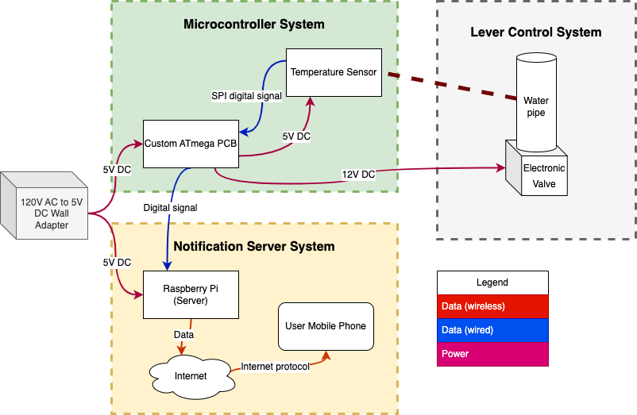
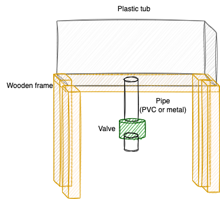
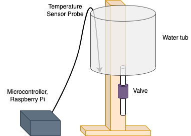
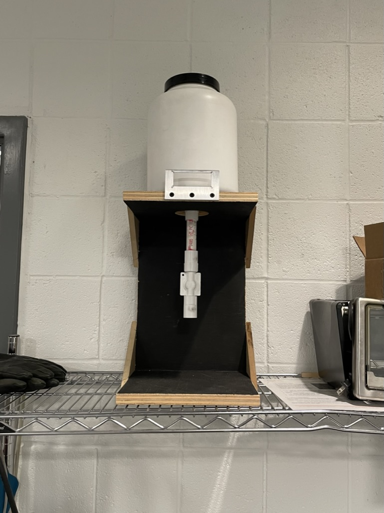
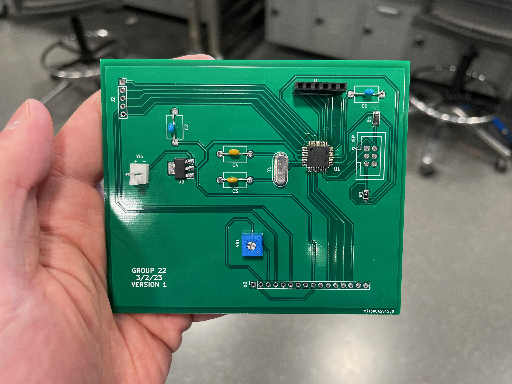
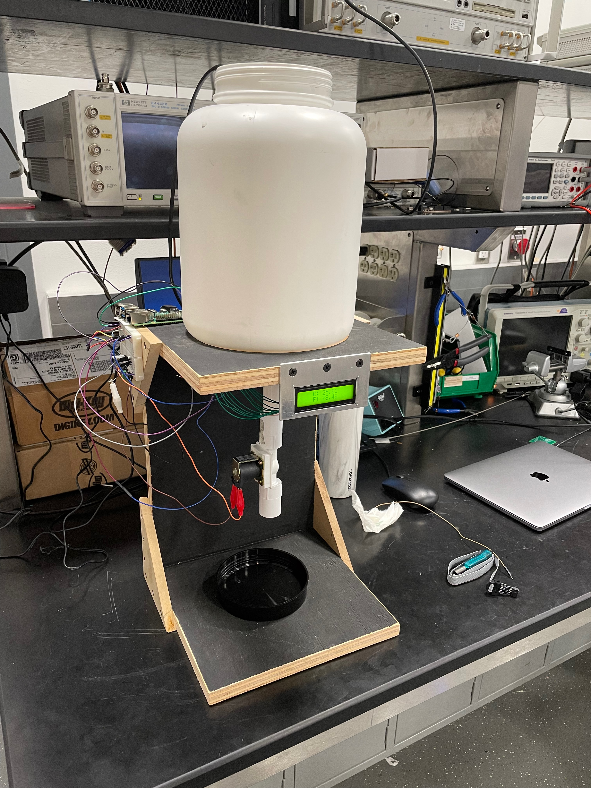
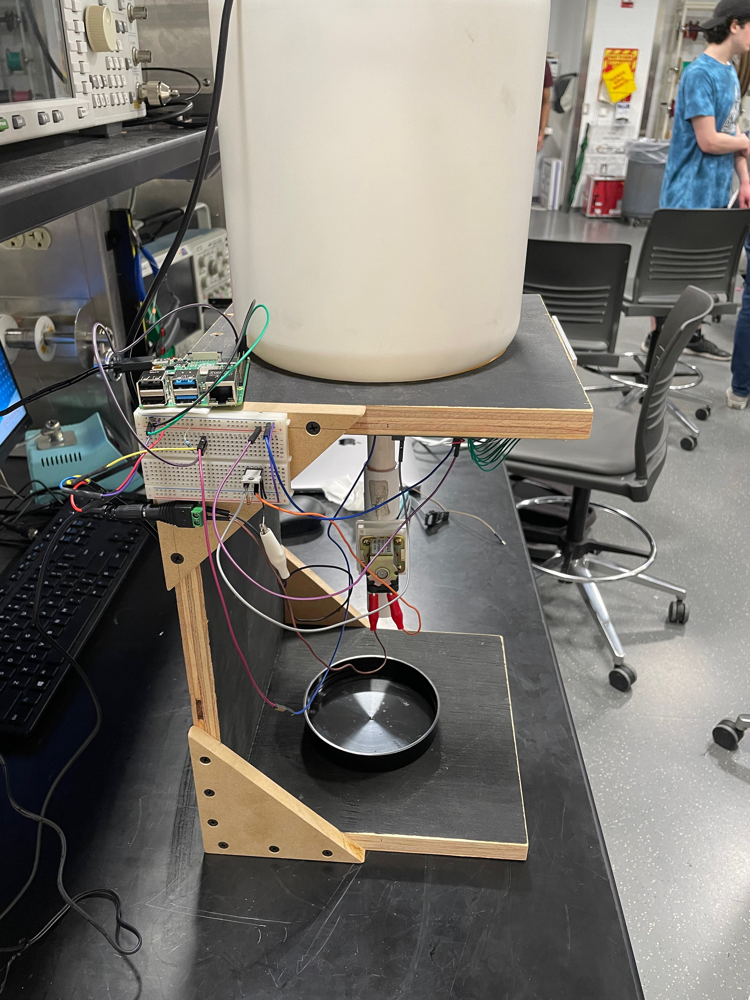
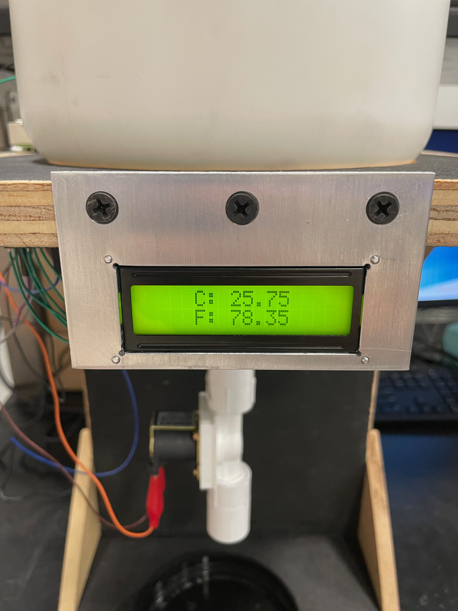
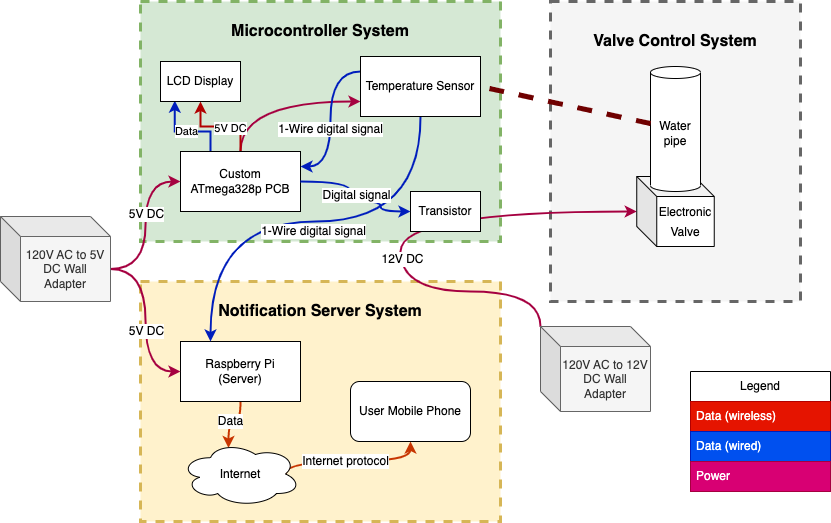

# Ethan's Lab Notebook


## 2/20/23
This past Friday, we met with Prannoy for our first weekly meeting. In this meeting, he gave us some feedback on our project proposal, for which I created a block diagram, and have attached the image below. His feedback primarily revolved around us needing to add more quantitative values and tolerances to the specifications of our project; otherwise, he said our project looked to be in good shape.



Additionally, earlier, Benedicta and I visited the machine shop in the ECE building and spoke with Gregg, the research lab shop supervisor. We explained to him our project and the general requirements for the structure that we would need to be constructed by the machine shop, by showing images and referring to a similar contraption already present in the machine shop. Below is the sketch that we initially brought forth, however, after our discussion with Gregg and what he thought was viable and practical, we anticipate having a bit of a different-looking setup.



We are currently in the process of designing our microcontroller PCB and composing the design document. Benedicta has already placed an order for some of our initial parts (valve, temperature sensor, LCD display), and Prannoy approved the order.


## 2/27/23
Last week, we wrote our Design Document and discussed it, along with other details of our project progress, with Prannoy during our weekly meeting. We also wrote our Team Contract and signed up for our Design Review and peer reviews.

Today we went back to the machine shop and met with Gregg again. We brought along the solenoid valve from the previous order which arrived, as well as the tub we plan to use for our setup. After discussion more further details with Gregg regarding our design and what we needed the machine shop to construct for us, we handed over the parts and he said we would be contacted once they finished building it, or if they had any further questions (though unlikely due to the simplicity of our setup). The revised setup is shown below.



Additionally, we went to the ECEB Electronics Services Shop with the list of PCB components we needed for our design, and picked out numerous capacitors and resistors of varying values. Then, we placed a second parts order for the remaining electronic components that we need for our PCB and circuit design, at least at this point in time.

Next, we plan to begin finalizing and checking our PCB design, as well as getting started on the Raspberry Pi programming.


## 3/3/23
This week, we had our Design Review with Professor Fliflet, Prannoy, and the student reviewers, during which we presented the details, requirements, and plans for our project. We also independently attended our own peer reviews for other project groups.

I got started on programming the Raspberry Pi, by first writing the OS image to the SD and booting it up, as well as connecting to the internet. I then tested to make sure I was able to successfully connect to the Raspberry Pi from my own computer via SSH for development. We are using Raspberry Pi OS Lite since we do not need the GUI for our purposes.


## 3/10/23
Early this week, we wrapped up the PCB design and submitted it to Prannoy to be manufactured and ordered. We also received our second shipment of parts, including our ATmega328P microcontrollers, which we then took inventory of and stored in our locker.

We met with both Prannoy and Professor Fliflet during our weekly team meeting, during which we clarified and verified that our usage of the Raspberry Pi is appropriate for our project.

Also, after exchanging some communication with Skee from the Machine Shop, we were able to pick up the physical setup apparatus for our project. It was constructed above and beyond to our specifications. An image is shown below. We stored it in the the ECE 2070 lab.



When we resume after break, we will start prototyping our microcontroller on a breadboard to test the functionality before our PCBs arrive.


## 3/24/23
This week, we continued with prototyping our microcontroller on the breadboard while we wait for our PCB to arrive. Unfortunately, we were unable to interface with the ATmega328p bootloader properly in the Arduino IDE, and could not upload test code as a result. We will seek further help in debugging next week.

Additionally, I made progress on programming the notification subsystem. We are using the open-source messaging app Telegram as the mobile app through which the push notifications will be received. The code will eventually also be pushed to this repository, but for now, here is an example script of how the push notifications are sent: 
```python
import requests
import yaml

# Bot token and chat id are stored in secret.yaml (not commited)
with open('secret.yaml', 'r') as f:
    config = yaml.safe_load(f)

TOKEN = str(config['token'])
CHAT_ID = str(config['chat_id'])

message = "Your kitchen sink pipe temperature reached 40°F, system activated"

url = f"https://api.telegram.org/bot{TOKEN}/sendMessage?chat_id={CHAT_ID}&text={message}"

# Send the message
print(requests.get(url).json())
```

Finally, we made revisions to our design document.


## 4/1/23
This week, we resumed debugging the breadboard version of our microcontroller circuit. We managed to resolve the issue with the ISP programmer, and were able to successfully upload a sketch to the ATmega328p to make an LED flash. We are still having issues getting the LCD display to work, but it is a work in progress. 

Today, I soldered the components that we had ordered and collected onto our custom PCB, as shown below. Some headers are not yet soldered because my teammate had them but they will be added soon.



Next, we will test the functionality of the microcontroller PCB to see if it works as intended, and if so we will continue working on the microcontroller sketch and sensors. If not, we will have to debug it quickly and revise our plans to hopefully order a new PCB design in time.


## 4/7/23
This week I primarily spent time debugging the PCB circuit of our microcontroller. We found that when Vin was connected to a 5v power supply it was causing a short circuit, as the voltage would drop significantly and the current would max out. We tried first switching out the microcontroller for a different one, but to no avail. After determining that the short circuit was caused by the microcontroller IC and not any of the other components, we cross referenced our PCB with an existing Arduino Uno and isolated some of the pins that we suspected may be related to the issue, namely bending up one of the Vcc pins from the board. I used the heat gun to quickly remove and reattach the surface-mount IC. 

Unfortunately, we were unable to successfully determine or fix the problem, so Benedicta revised the PCB and we sent it in to be ordered. I also placed an order for additional parts that we would need for the new PCB when it arrives. On the bright side, our microcontroller program and circuit with the valve is working as intended on the breadboard, so we have this as a fallback option in the even that our revised PCB is also unable to function properly. Next, I will work on integrating the microcontroller subsystem with the Raspberry Pi for the notification subsystem.


## 4/18/23
Unfortunately, we have run into some technicaly difficulties regarding setting up the Raspberry Pi internet functionality in the ECE Building for the demo, due to the fact that IllinoisNet is enterprise wifi which requries a much more complicated setup than a typical home wi-fi due to the certificate, logins and additional parameters involved. As a result, setting up the wi-fi from the SD card boot imager appears to be not viable, and we have determined that the best way to proceed would be to access the GUI of the Raspberry Pi's OS, rather than the headless method we had previosuly employed. We did not have the micro HDMI to HDMI cable necessary to output to a monitor, so I ordered one on Amazon so we can begin working on this issue ASAP.


## 4/20/23
We were able to resolve the wi-fi issue by connecting the pi to IllinoisNet_Guest via the GUI. We also confirmed that the Raspberry Pi could read the sensor data in sync with the microcontroller PCB, and send the mobile notification when the temperature drops below the threshold, as intended. We tested by setting the threshold to 80 degrees F and warming up the probe with my hand, then allowing the temperature to drop to room temperature.

Additionally, I soldered the new components onto our new PCB design, which just arrived. Compared to our last PCB, the short circuit issue was no longer present, and the PCB functioned fully as intended. We were able to successfully burn the bootloader onto the ATmega328p IC and upload the program, which properly read the temperature via the one-wire protocol and outputted it to the LCD display, while triggering the valve when the threshold was met. This worked in conjunction with the now-functiong Raspberry Pi notification subsystem to fulfill the full functionality of our project, as laid out in our initial goals and documentation.

We also had our mock demo today with Prannoy. I implemented a fix to the software to handle the exception that arises if the Raspberry Pi attempts to read from the temperature sensor while the bus is occupied, which would originally cause the script execution to exit and break the notification funcionality. I also attached the PCB and breadboard to the contraption in order to keep it out of the way for the demo. Images of the demo-ready rig are shown below:


Now, in preparation for the demo, we primarily just need to adjust the temperature thresholds in the microcontroller and Pi to match our originally intended range, as well as reconnect the Pi to wi-fi since the sessions do not last very long on IllinoisNet_Guest.






# 4/28/23
This week, we had our final demo for our project. It was sucessful, as all subsystems worked properly and in conjunction. We did encounter some last minute technical mishaps but I was able to repair them in time for the demo. We also took a video of the system working and submitted it to our project on the website. We also had our mock presentation, so now all we have left is the the presentation and final report.

Here is the updated block diagram corresponding to our project in the final demo:

